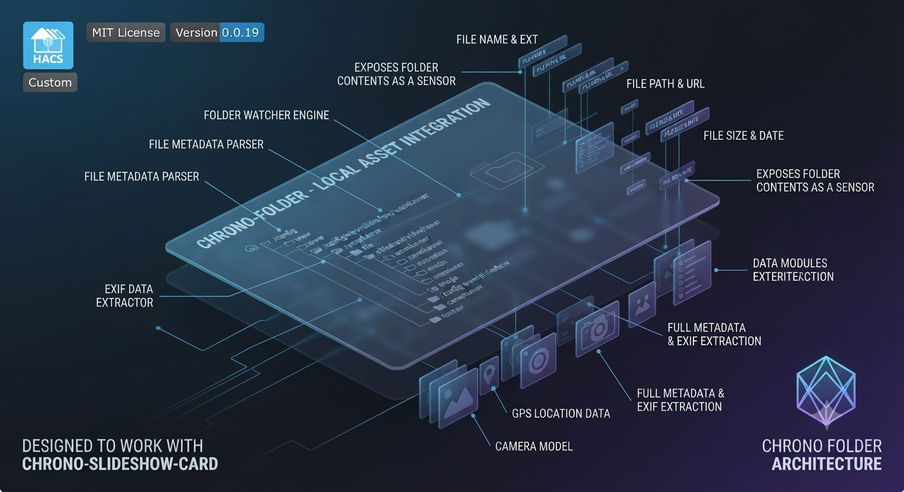

  
  
  

  

  
  
  A Home Assistant custom integration that watches a local folder and exposes its contents as a sensor, including file metadata and EXIF data. Designed to work with chrono-slideshow-card and other chrono-* cards.

---

## Installation

### HACS (recommended)

Add this repository as a custom repository in HACS, then install **Chrono Folder** from the integrations section.

### Manual

Copy `custom_components/chrono_folder/` into your Home Assistant `config/custom_components/` folder and restart Home Assistant.

---

## Configuration

After installation, go to **Settings → Devices & Services → Add Integration** and search for **Chrono Folder**.

---

## License

MIT
